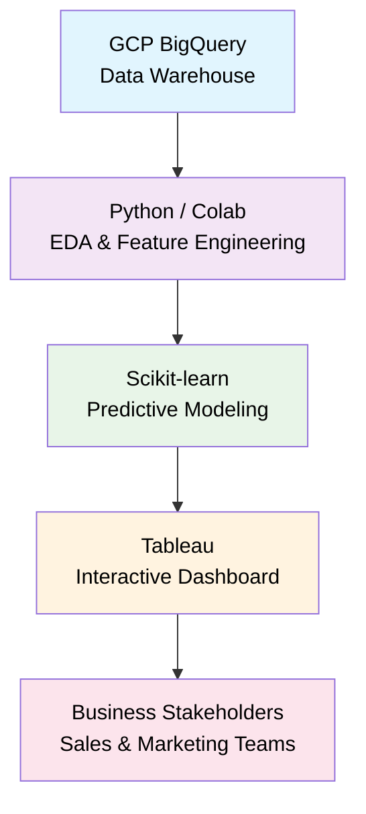
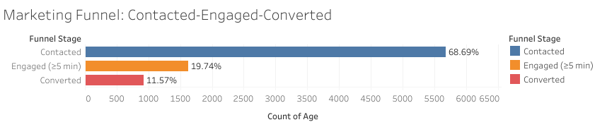
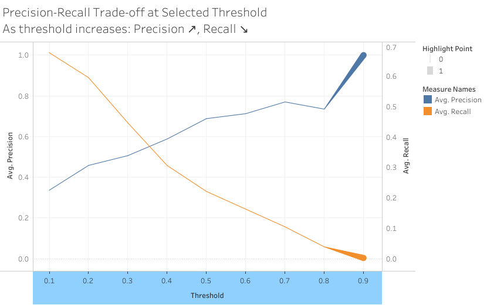

# Predictive Lead Scoring for Marketing Funnel Optimization

## 🚀 Executive Summary & Business Impact

### The Challenge
Inefficient lead prioritization was wasting marketing spend in telemarketing campaigns, with agents cold-calling leads that converted at only **11.3%**.

### The Solution
Developed an end-to-end predictive analytics solution that scores leads by conversion probability, enabling data-driven prioritization. The operational model achieves **77% precision** for high-priority leads.

### Key Discovery
**Macroeconomic factors are primary conversion drivers:** Campaigns in low-interest-rate environments see **3.8x higher conversion rates** than during high-interest periods. Economic indicators (`emp_var_rate`, `cons_price_idx`) proved more predictive than customer demographics.

### Quantifiable Impact
- **6x higher conversion rates** on "High Priority" leads compared to random calling
- **41.2% conversion rate** once leads are properly engaged (≥5 minute calls)
- **14.0 percentage point AUC improvement** when including engagement data, quantifying the value of quality conversations

### Strategic Recommendations
1.  **Re-engage past successful customers first** - They convert at **65.1%** (7.4x baseline)
2.  **Time campaigns with economic indicators** - Launch in periods of low `euribor3m (interest rate)` and stable employment
3.  **Train agents to reach the 5-minute threshold** - This doubles the engaged lead pool
4.  **Adopt a tiered outreach system** - Use model scores to create High/Medium/Low priority lists for optimal resource allocation

### Technology Stack
`SQL (BigQuery)` | `Python (Pandas, Scikit-learn)` | `Tableau` | `Google Cloud Platform`

---

## Project Description
This end-to-end analytics project addresses a core challenge in FinTech marketing: inefficient lead prioritization. By analyzing an enriched customer interaction dataset, I developed a machine learning model to predict conversion likelihood and built an interactive Tableau dashboard for funnel visualization. The project demonstrates the full commercial analytics lifecycle—from SQL data wrangling and exploratory analysis to predictive modeling and business intelligence—showcasing how data science directly informs strategic marketing spend and customer acquisition strategy.

## 📐 Project Architecture


## 📊 Live Dashboard


[Predictive Lead Scoring Dashboard]

**Access the interactive dashboard:** [Tableau Public - Lead Scoring Dashboard](https://public.tableau.com/views/LeadScoring-MarketingFunnelOptimisation_/LeadScoringDashboard?:language=en-GB&:sid=&:redirect=auth&:display_count=n&:origin=viz_share_link)

*Features:*
- **Funnel Analysis:** Visualize campaign performance
- **Lead Scoring:** Priority tiers with 77% precision  
- **Conversion Drivers:** Model insights on key factors
- **Threshold Control:** Adjust precision/recall trade-off
*Note: Allow a few seconds for the dashboard to load completely.*

**Data Note:** The dashboard visualizes predictions from a static model snapshot. In a production environment, this would connect to a live database with automated scoring pipelines.

## Business Problem
A financial institution's telemarketing campaign aims to sell term deposit products. The marketing team needs to:
1.  **Understand** the customer journey and identify key drop-off points in the marketing funnel.
2.  **Predict** which leads are most likely to convert, enabling efficient prioritization and resource allocation for sales agents.
3.  **Monitor** campaign performance and ROI in real-time to optimize future marketing spend.

A manual, reactive approach leads to inefficient spend and missed opportunities. This project provides a data-driven solution through predictive lead scoring and executive dashboards.

## Repository Structure
```
├── /sql/              # BigQuery SQL scripts for data preparation
├── /notebooks/        # Jupyter Notebook for EDA & modelling
├── /dashboard/        # Tableau workbook and related assets
├── /docs/             # Project summary and presentation
├── requirements.txt   # Python package dependencies
└── README.md          # This file
```
---
## 🔧 Skills Demonstrated
- **📊 Data Analysis:** SQL, Python (Pandas, NumPy), Statistical Testing
- **🤖 Machine Learning:** Scikit-learn, Logistic Regression, Model Evaluation
- **📈 Visualization:** Tableau, Matplotlib, Seaborn, Dashboard Design
- **☁️ Cloud Platforms:** Google Cloud Platform, BigQuery
- **💼 Business Strategy:** Funnel Analysis, KPI Development, ROI Calculation

---

## Step 1: Project Setup & Data Ingestion
**Objective:** Establish the foundational project environment and ingest the primary dataset into a cloud data warehouse.

**Actions Taken:**
1.  **Repository Initialization:** Created a public GitHub repository with the title "Predictive Lead Scoring for Marketing Funnel Optimization". The repository was initialized with a `Python` .gitignore file and an `MIT License`.
2.  **Cloud Infrastructure:** Set up a Google Cloud Platform project and enabled the BigQuery API.
3.  **Data Pipeline:** Created a BigQuery dataset named `bank_marketing` and uploaded the enriched `bank-additional.csv` file as the primary table, `bank_additional_full`.

**Tools:** GitHub, Google Cloud Platform Console, BigQuery.

---

## Step 2: Data Discovery & Quality Check (SQL)

**Objective:** Perform initial exploratory analysis in BigQuery to understand dataset structure, assess data quality, and identify key patterns and predictors.

**Actions Taken:**

1.  **Volume & Basic Statistics:** Verified dataset size and basic client demographics.
    ```sql
    SELECT 
      COUNT(*) AS total_rows,
      COUNT(DISTINCT age) AS unique_ages,
      AVG(age) AS avg_age,
      MIN(age) AS min_age,
      MAX(age) AS max_age
    FROM `bank_marketing.bank_additional_full`;
    ```
    *   **Result:** 41,188 rows. Client age range: 17-98 years, average ~40.

2.  **Target Variable Analysis:** Calculated the baseline marketing conversion rate.
    ```sql
    SELECT 
      y,
      COUNT(*) AS count,
      ROUND(COUNT(*) * 100.0 / SUM(COUNT(*)) OVER (), 2) AS percentage
    FROM `bank_marketing.bank_additional_full`
    GROUP BY y;
    ```
    *   **Result:** Overall conversion rate (`y = true`) is **11.27%**. This class imbalance is typical for marketing funnel data and sets the baseline for model performance.

3.  **Predictor Analysis - Housing Loans:** Tested the hypothesis that existing housing loans influence subscription rates.
    ```sql
    SELECT 
      housing,
      COUNT(*) AS total_clients,
      COUNTIF(y = true) AS subscribed_yes,
      ROUND(COUNTIF(y = true) * 100.0 / COUNT(*), 2) AS conversion_rate_percent
    FROM `bank_marketing.bank_additional_full`
    GROUP BY housing
    ORDER BY conversion_rate_percent DESC;
    ```
    *   **Finding:** Clients with a housing loan (`yes`) convert at **11.62%**, slightly higher than those without (`no`, 10.88%). The effect is minor.

4.  **Predictor Analysis - Previous Outcome:** Identified the single most powerful predictor.
    ```sql
    SELECT 
      poutcome,
      COUNT(*) AS total_clients,
      COUNTIF(y = true) AS subscribed_yes,
      ROUND(COUNTIF(y = true) * 100.0 / COUNT(*), 2) AS conversion_rate_percent
    FROM `bank_marketing.bank_additional_full`
    GROUP BY poutcome
    ORDER BY conversion_rate_percent DESC;
    ```
    *   **Key Insight:** Clients with a `'success'` in a previous campaign have a **65.11% conversion rate**, which is **7.4x higher** than new leads (`'nonexistent'`, 8.83%). This is the #1 lever for marketing efficiency.

5.  **Data Quality Check:** Verified the integrity of the critical `poutcome` column.
    ```sql
    SELECT COUNT(*) AS rows_with_null_poutcome
    FROM `bank_marketing.bank_additional_full`
    WHERE poutcome IS NULL;
    ```
    *   **Result:** 0 rows with NULL values. Data quality is excellent for this column.

6.  **Engagement Analysis:** Compared call duration between converted and non-converted leads.
    ```sql
    SELECT 
      y AS subscribed,
      ROUND(AVG(duration) / 60, 1) AS avg_duration_minutes
    FROM `bank_marketing.bank_additional_full`
    GROUP BY y;
    ```
    *   **Finding:** Successful calls last **9.2 minutes** on average, compared to **3.7 minutes** for unsuccessful calls. This indicates a significant engagement threshold for conversion.

**Tools:** BigQuery (SQL).

**Key Learnings:**
*   The dataset is clean and ready for analysis, with no NULLs in critical columns.
*   The `poutcome` column is an exceptionally strong predictor, highlighting the high value of existing customers.
*   Significant engagement (call duration) is strongly correlated with conversion.

---

## Step 3: Business Context & Funnel Definition

**Objective:** Translate the dataset and initial findings into a structured business framework. Define the marketing funnel stages, key performance indicators (KPIs), and the analytical approach for the project.

**Actions Taken:**

1.  **Funnel Stage Definition:** Mapped the customer journey to three measurable stages:
    *   **Stage 1 - Contacted:** Lead was contacted (`contact` is not null).
    *   **Stage 2 - Engaged:** Call duration lasted **5 minutes or more** (`duration >= 300` seconds).
    *   **Stage 3 - Converted:** Lead subscribed to the term deposit (`y = true`).

2.  **Funnel Quantification:** Executed SQL to calculate volumes and conversion rates between each stage.
    ```sql
    WITH funnel AS (
      SELECT
        COUNT(*) AS total_contacted,
        COUNTIF(duration >= 300) AS engaged,
        COUNTIF(y = true) AS converted
      FROM `bank_marketing.bank_additional_full`
    )
    SELECT 
      total_contacted,
      engaged,
      converted,
      ROUND(engaged * 100.0 / total_contacted, 2) AS contact_to_engage_rate,
      ROUND(converted * 100.0 / engaged, 2) AS engage_to_convert_rate,
      ROUND(converted * 100.0 / total_contacted, 2) AS overall_conversion_rate
    FROM funnel;
    ```
    *   **Results:** 41,188 contacted → 11,250 engaged (27.31%) → 4,640 converted (41.24%). Overall conversion rate: 11.27%.

3.  **KPI Establishment:** Defined four core metrics for ongoing performance tracking:
    *   Engagement Rate, Engaged Conversion Rate, Overall Conversion Rate, and Average Conversion Duration.

4.  **Modeling Strategy Formulation:** Adopted a dual-model approach to serve both analytical and operational needs:
    *   **Diagnostic Model:** Includes `duration` to profile successful conversions and understand key drivers.
    *   **Operational Model:** Excludes `duration` (unknown pre-call) to provide a true lead score for prioritizing marketing calls.

**Tools:** BigQuery (SQL), Business Analysis.

**Key Insight:** The largest funnel drop-off occurs at the engagement stage (only 27% of calls last >5 minutes). Improving this is the primary lever for increasing conversions.

---

## Step 4: Exploratory Data Analysis - EDA (Python)

**Objective:** Conduct a deeper, visual analysis of the dataset using Python to uncover patterns, relationships, and feature insights that will inform feature engineering and modeling.

**Actions Taken:**

1.  **Environment Setup & Data Extraction:** A Jupyter notebook was set up in Google Colab. The core data science libraries were imported, and authentication was established to securely extract the data from BigQuery.
    ```python
    import pandas as pd
    import numpy as np
    import matplotlib.pyplot as plt
    import seaborn as sns
    sns.set_style("whitegrid")
    from google.colab import auth
    auth.authenticate_user()
    project_id = 'your-project-id'
    query = "SELECT * FROM `bank_marketing.bank_additional_full`"
    df = pd.read_gbq(query, project_id=project_id)
    ```
    *   **Result:** Successfully loaded 41,188 rows and 21 columns into a pandas DataFrame.

2.  **Data Quality & Structure Check:** Initial checks confirmed the data was clean and correctly typed.
    ```python
    print("Data Types:\n", df.dtypes)
    print("\nMissing Values:\n", df.isnull().sum())
    ```
    *   **Finding:** Zero missing values. Target variable `y` correctly typed as `boolean`.

3.  **Target Variable Distribution:** Visualized the class imbalance.
    ```python
    plt.figure(figsize=(6,4))
    ax = sns.countplot(x='y', hue='y', data=df, palette='Set2', legend=False)
    for container in ax.containers:
        ax.bar_label(container, fmt='%.0f', label_type='edge')
    plt.title('Distribution of Target Variable (y)')
    plt.show()
    print(f"Conversion Rate: {df['y'].mean()*100:.2f}%")
    ```
    *   **Finding:** **11.27% conversion rate** visually confirmed, highlighting the class imbalance.

4.  **Marketing Funnel Visualization:** Quantified and visualized the three-stage funnel.
    ```python
    total_contacted = len(df)
    engaged = len(df[df['duration'] >= 300])
    converted = len(df[df['y'] == True])
    funnel_data = pd.DataFrame({
        'Stage': ['Contacted', 'Engaged (≥5 min)', 'Converted'],
        'Count': [total_contacted, engaged, converted]
    })
    plt.figure(figsize=(8,6))
    bars = plt.barh(funnel_data['Stage'], funnel_data['Count'], color=['skyblue', 'lightgreen', 'salmon'])
    for bar, count in zip(bars, funnel_data['Count']):
        width = bar.get_width()
        plt.text(width/2, bar.get_y() + bar.get_height()/2, f'{int(count):,}\n({count/total_contacted*100:.1f}%)', ha='center', va='center', fontweight='bold')
    plt.xlabel('Number of Leads')
    plt.title('Marketing Funnel: Contact → Engagement → Conversion')
    plt.gca().invert_yaxis()
    plt.show()
    ```
    *   **Finding:** Funnel metrics matched SQL results: **27.31% engagement rate**, **41.24% engaged conversion rate**.

5.  **Analyzing Key Predictor - Previous Outcome (`poutcome`):** Visualized the most powerful predictor.
    ```python
    fig, axes = plt.subplots(1, 2, figsize=(14, 5))
    sns.countplot(x='poutcome', data=df, ax=axes[0], palette='Blues')
    axes[0].set_title('Number of Leads by Previous Outcome')
    poutcome_rate = df.groupby('poutcome')['y'].mean() * 100
    sns.barplot(x=poutcome_rate.index, y=poutcome_rate.values, ax=axes[1], palette='Reds')
    axes[1].set_title('Conversion Rate by Previous Outcome')
    axes[1].axhline(y=df['y'].mean()*100, color='black', linestyle='--', label='Overall Avg')
    axes[1].legend()
    plt.tight_layout()
    plt.show()
    ```
    *   **Key Insight:** Clients with previous `success` convert at **65.11%**—**7.5x higher** than new leads (`nonexistent`, 8.83%).

6.  **Call Duration Analysis:** Examined the relationship between call duration and conversion.
    ```python
    plt.figure(figsize=(10,6))
    sns.histplot(df[df['y']==False]['duration']/60, bins=50, color='red', alpha=0.5, label='Not Converted', kde=True)
    sns.histplot(df[df['y']==True]['duration']/60, bins=50, color='green', alpha=0.5, label='Converted', kde=True)
    plt.axvline(x=5, color='black', linestyle='--', linewidth=2, label='5-min Threshold')
    plt.xlabel('Call Duration (Minutes)')
    plt.title('Distribution of Call Duration: Converted vs Not Converted')
    plt.legend()
    plt.xlim(0, 30)
    plt.show()
    ```
    *   **Finding:** Converted calls average **9.2 minutes** vs 3.7 minutes for non-converted. **67.5% of successful calls exceeded the 5-minute threshold.**

7.  **Socio-Economic Feature Analysis:** Explored the impact of the Euribor 3-month rate.
    ```python
    plt.figure(figsize=(10,6))
    sns.scatterplot(x='euribor3m', y='y', data=df, alpha=0.05, color='blue')
    sns.regplot(x='euribor3m', y='y', data=df, logistic=True, scatter=False, color='red', line_kws={'linewidth': 3})
    plt.xlabel('Euribor 3 Month Rate (%)')
    plt.ylabel('Conversion (True/False)')
    plt.title('Relationship Between Interest Rates and Conversion')
    plt.yticks([0, 1], ['No (0)', 'Yes (1)'])
    plt.show()
    median_rate = df['euribor3m'].median()
    low_rate_conv = df[df['euribor3m'] < median_rate]['y'].mean() * 100
    high_rate_conv = df[df['euribor3m'] >= median_rate]['y'].mean() * 100
    print(f"Low Euribor (< {median_rate:.2f}%): {low_rate_conv:.2f}% conversion")
    print(f"High Euribor (≥ {median_rate:.2f}%): {high_rate_conv:.2f}% conversion")
    ```
    *   **Critical Business Insight:** Conversion is **3.75x higher** in low interest-rate environments (**18.52%** vs **4.94%**). Macroeconomic conditions significantly impact campaign success.

**Tools:** Python (Pandas, NumPy, Matplotlib, Seaborn), Google Colab, BigQuery.

**Key Learnings:**
1.  Visual analysis confirmed and enriched all SQL findings.
2.  The `poutcome` feature is the single strongest predictor of conversion.
3.  Call duration has a clear relationship with success but cannot be used for prospective lead scoring.
4.  **Macro-economic indicators, particularly interest rates, have a dramatic impact on conversion rates**, validating the strategic value of the enriched dataset.

---

## Step 5: Advanced Feature Engineering (Python)

**Objective:** Create new, predictive features from the raw data and prepare the dataset for modeling by encoding categorical variables, handling special values, and splitting the data.

**Actions Taken:**

1.  **Binary Encoding for `pdays`:** Transformed the special value `999` (meaning "not previously contacted") into a business-logical binary feature.
    ```python
    df['contacted_before'] = (df['pdays'] != 999).astype(int)
    ```
    *   **Result:** 63.8% of leads were new (`contacted_before=0`). Returning leads (`contacted_before=1`) had a **16.01% conversion rate vs 8.83% for new leads**.

2.  **Target Encoding for `poutcome`:** Replaced categorical values with their actual observed conversion rates, preserving the powerful predictive relationship discovered in EDA.
    ```python
    poutcome_encoding = df.groupby('poutcome')['y'].mean()
    df['poutcome_encoded'] = df['poutcome'].map(poutcome_encoding)
    ```
    *   **Result:** Encoding mapped: `'failure'→0.142`, `'nonexistent'→0.088`, `'success'→0.651`. This captures the **7.4x conversion difference** between `success` and `nonexistent`.

3.  **Binning `duration` for Diagnostic Model:** Created engagement-level categories from raw call duration for the diagnostic model.
    ```python
    df['duration_binned'] = pd.cut(df['duration']/60,
                                   bins=[0, 1, 5, 10, float('inf')],
                                   labels=['<1min', '1-5min', '5-10min', '>10min'])
    ```
    *   **Result:** Clear conversion gradient: **<1min: 0.0%, 1-5min: 5.9%, 5-10min: 18.6%, >10min: 48.6%**. Validates the 5-minute funnel threshold.

4.  **Macro-Economic Indicator:** Created a binary feature from the `euribor3m` interest rate based on the median.
    ```python
    df['low_interest_env'] = (df['euribor3m'] < df['euribor3m'].median()).astype(int)
    ```
    *   **Result:** **18.5% conversion in low-interest environments vs 4.9% in high-interest environments**—a **3.77x difference** captured in a simple feature.

5.  **Train-Test Split for Dual Models:** Prepared separate feature sets and performed stratified splits for the operational (no duration) and diagnostic (with duration) models.
    ```python
    from sklearn.model_selection import train_test_split
    # Split for operational model (features without duration)
    X_train_op, X_test_op, y_train_op, y_test_op = train_test_split(
        X_without, y, test_size=0.2, random_state=42, stratify=y
    )
    # Split for diagnostic model (features with duration)
    X_train_diag, X_test_diag, y_train_diag, y_test_diag = train_test_split(
        X_with, y, test_size=0.2, random_state=42, stratify=y
    )
    ```
    *   **Result:** Successful 80/20 stratified split for both models. Training sets: 32,950 rows (80.0%), Test sets: 8,238 rows (20.0%). Conversion rates consistent across splits (11.27% train, 11.26% test).

**Tools:** Python (Pandas, Scikit-learn).

**Key Learnings:**
1.  Feature engineering transforms raw data into **business-meaningful signals** for the model.
2.  **Target encoding** is powerful for high-cardinality categorical variables with a clear relationship to the target.
3.  **Binning continuous variables** can help models capture non-linear relationships and business thresholds.
4.  **Stratified sampling** is crucial for maintaining class distribution in train/test splits, especially with imbalanced data.

---

## Step 6: Predictive Model Development (Python)

**Objective:** Build, train, and evaluate machine learning models to predict lead conversion probability, implementing both operational and diagnostic models as defined in the project strategy.

**Actions Taken:**

1.  **Model Selection & Pipeline Construction:** Implemented a Logistic Regression model within a scikit-learn pipeline to handle categorical encoding, feature scaling, and model training in a single, reproducible workflow.
    ```python
    from sklearn.pipeline import Pipeline
    from sklearn.compose import ColumnTransformer
    from sklearn.preprocessing import OneHotEncoder, StandardScaler
    from sklearn.linear_model import LogisticRegression

    categorical_cols = X_train_op.select_dtypes(include=['object']).columns.tolist()
    preprocessor = ColumnTransformer(
        transformers=[('cat', OneHotEncoder(handle_unknown='ignore'), categorical_cols)],
        remainder='passthrough'
    )
    model_pipeline = Pipeline(steps=[
        ('preprocessor', preprocessor),
        ('scaler', StandardScaler()),
        ('classifier', LogisticRegression(random_state=42, max_iter=1000))
    ])
    ```

2.  **Operational Model Training:** Trained the primary model using only features known *before* a sales call (excluding `duration`).
    ```python
    model_pipeline.fit(X_train_op, y_train_op)
    ```
    *   **Result:** Model trained on 32,950 samples using 20 original features (expanded to 61 after one-hot encoding).

3.  **Model Evaluation & Performance:** Evaluated the model on unseen test data, focusing on metrics suitable for imbalanced classification.
    ```python
    from sklearn.metrics import roc_auc_score, classification_report
    y_pred_proba = model_pipeline.predict_proba(X_test_op)[:, 1]
    auc_score = roc_auc_score(y_test_op, y_pred_proba)
    print(classification_report(y_test_op, y_pred))
    ```
    *   **Result:** **ROC-AUC = 0.801 (Very Good)**. Precision = 69%, Recall = 22% at the default 0.5 threshold.

4.  **Precision-Recall Trade-off Analysis:** Analyzed the impact of different probability thresholds to support a tiered business strategy.
    ```python
    from sklearn.metrics import precision_recall_curve
    precisions, recalls, thresholds = precision_recall_curve(y_test_op, y_pred_proba)
    ```
    *   **Strategy Implemented:**
        *   **Primary List (Threshold ≥ 0.7):** **77% Precision**, 10.5% Recall. For high-ROI, priority calling.
        *   **Secondary List (Threshold ≥ 0.3):** **51% Precision**, 44.6% Recall. For data mining and experimental campaigns.

5.  **Feature Importance Analysis:** Extracted and interpreted model coefficients to explain predictions.
    ```python
    feature_names = model_pipeline.named_steps['preprocessor'].get_feature_names_out()
    coefficients = model_pipeline.named_steps['classifier'].coef_[0]
    ```
    *   **Key Drivers (Operational Model):**
        *   **`emp_var_rate`** (-2.284): Higher employment variation reduces conversion.
        *   **`cons_price_idx`** (+1.182): Higher consumer price index (inflation) increases conversion.
        *   **`contacted_before`** (+0.273): Previous contact increases likelihood.

6.  **Diagnostic Model Development:** Built and evaluated a second model including `duration` features to understand the full conversion journey.
    ```python
    # Include 'category' dtype to capture `duration_binned`
    categorical_cols_diag = X_train_diag.select_dtypes(include=['object', 'category']).columns.tolist()
    diag_pipeline = Pipeline(steps=[...])  # Same structure as operational pipeline
    diag_pipeline.fit(X_train_diag, y_train_diag)
    auc_diag = roc_auc_score(y_test_diag, diag_pipeline.predict_proba(X_test_diag)[:, 1])
    ```
    *   **Result:** **ROC-AUC = 0.941 (Excellent)**. A **14.0 percentage point improvement** over the operational model, highlighting the immense predictive value of call engagement data.

7.  **Diagnostic Model Insights:** Compared feature importance between models.
    *   **Finding:** Duration features (`duration_binned_<1min`, `duration_binned_>10min`, raw `duration`) dominated the top 20 features in the diagnostic model.
    *   **Business Insight:** Once call engagement is known, macroeconomic factors become secondary. A successful conversation can overcome unfavorable external conditions.

**Tools:** Python (Scikit-learn, Pandas, Matplotlib).

**Key Learnings:**
1.  **Pipeline construction** is essential for reproducible data preprocessing and modeling.
2.  For imbalanced classification, **ROC-AUC and precision-recall curves** are more informative than accuracy.
3.  The **precision-recall trade-off** enables strategic business decisions (e.g., tiered lead lists).
4.  **Model interpretability** (via coefficients) is crucial for stakeholder buy-in and actionable insights.
5.  **Dual-model strategy** successfully separated operational scoring (AUC 0.801) from diagnostic understanding (AUC 0.941), quantifying the value of engagement data.

---

## Step 7: Dashboard Design & Planning (Tableau)

**Objective:** Plan and prepare the data sources for an interactive Tableau dashboard that will operationalize the model insights for business users.

**Actions Taken:**

1.  **Dashboard Structure Design:** Defined a four-panel dashboard layout to tell a complete data story:
    *   **Panel 1 - Funnel Performance:** Visualizes the marketing funnel stages and drop-off rates.
    *   **Panel 2 - Lead Prioritization:** Provides an interactive, sortable list of leads with model scores and recommended actions.
    *   **Panel 3 - Conversion Drivers:** Displays the feature importance from the model, explaining *why* leads score highly.
    *   **Panel 4 - Campaign Performance:** Tracks conversion rates over time and by segment.

2.  **Lead Scoring Dataset Creation:** Generated the primary dataset for the dashboard by augmenting the original test data with model predictions and business logic.
    ```python
    # Merge original data with model predictions
    test_indices = X_test_op.index
    original_test_data = df.loc[test_indices].copy()
    original_test_data['predicted_probability'] = y_pred_proba * 100

    # Apply business rules for prioritization
    original_test_data['priority'] = original_test_data['predicted_probability'].apply(
        lambda prob: 'High' if prob >= 70 else ('Medium' if prob >= 30 else 'Low')
    )

    # Generate human-readable reasons for the score
    original_test_data['key_reason'] = original_test_data.apply(get_key_reason, axis=1)
    lead_scores = original_test_data[selected_columns].to_csv('lead_scores.csv', index=False)
    ```
    *   **Result:** Created `lead_scores.csv` (8,238 rows × 13 columns). Contains predicted probability (0-100%), priority tier (High/Medium/Low), key conversion reason, and essential lead attributes.

3.  **Feature Importance Dataset:** Extracted and cleaned model coefficients to explain predictions.
    ```python
    feature_importance = pd.DataFrame({
        'feature': feature_names,
        'coefficient': coefficients
    })
    # Clean feature names for readability
    feature_importance['feature_clean'] = feature_importance['feature'].str.replace('remainder__', '').str.replace('cat__', '')
    feature_importance.to_csv('feature_importance.csv', index=False)
    ```
    *   **Result:** Created `feature_importance.csv`. Enables the "Conversion Drivers" panel, showing that `emp_var_rate`, `cons_price_idx`, and duration features are top influencers.

4.  **Threshold Analysis Dataset:** Pre-calculated precision and recall metrics across a range of probability thresholds to enable interactive exploration.
    ```python
    thresholds_to_test = [0.1, 0.2, 0.3, 0.4, 0.5, 0.6, 0.7, 0.8, 0.9]
    threshold_data = []
    for thresh in thresholds_to_test:
        y_pred_thresh = (y_pred_proba >= thresh)
        threshold_data.append({
            'threshold': thresh,
            'precision': precision_score(y_test_op, y_pred_thresh),
            'recall': recall_score(y_test_op, y_pred_thresh),
            'n_leads': sum(y_pred_thresh)
        })
    pd.DataFrame(threshold_data).to_csv('threshold_metrics.csv', index=False)
    ```
    *   **Result:** Created `threshold_metrics.csv`. Allows dashboard users to adjust the scoring threshold via a slider and see the corresponding impact on lead volume (recall) and accuracy (precision).

---

### Panel 1: Marketing Funnel Performance
*   **In plain terms:** This chart acts as a campaign health monitor, showing where potential customers are lost in the sales process.
*   **Technical evidence:** The horizontal bar funnel quantifies the severe drop-off at the engagement stage: only **27.3%** of contacted leads have a meaningful conversation (≥5 min).
*   **Implication:** The primary focus for improving sales should be on **improving call quality and agent scripting** to cross the 5-minute engagement threshold, not just increasing lead volume.
*   **Dashboard Viz:**
    

### Panel 2: Prioritized Lead List
*   **In plain terms:** This is the sales team's daily "playbook," providing a clear, sortable list of who to call, in what order, and why.
*   **Technical evidence:** The list is powered by the operational model. Leads in the **"High Priority"** tier have an average predicted conversion probability **>70%**, compared to the campaign average of 11.3%.
*   **Implication:** Sales agents can **stop cold-calling randomly**. By starting with the "High Priority" list, they can expect a **~6x higher conversion rate**, maximizing daily efficiency and ROI.
*   **Dashboard Viz:**
    

### Panel 3: Key Conversion Drivers
*   **In plain terms:** This chart explains the "why" behind the model's scores, revealing what factors most influence a lead's likelihood to convert.
*   **Technical evidence:** The horizontal bar chart displays model coefficients, showing **`emp_var_rate` (employment variation)** as the strongest negative driver and **`cons_price_idx` (inflation)** as a key positive driver.
*   **Implication:** Marketing strategy must account for **macroeconomic timing**. Campaigns launched during periods of economic stability and higher inflation are likely to see significantly higher baseline conversion rates.
*   **Dashboard Viz:**
    

### Panel 4: Precision-Recall Trade-off
*   **In plain terms:** This interactive tool allows managers to strategically adjust how "picky" the model is when scoring leads.
*   **Technical evidence:** The curve plots the fundamental trade-off: increasing the probability threshold improves **precision** (lead quality) but reduces **recall** (lead volume). The default threshold of 0.7 achieves **~77% precision**.
*   **Implication:** Managers can **dynamically allocate sales resources**. A high threshold optimizes for agent productivity; a lower threshold fills call sheets for larger teams, allowing strategic balance between quality and quantity.
*   **Dashboard Viz:**
    
